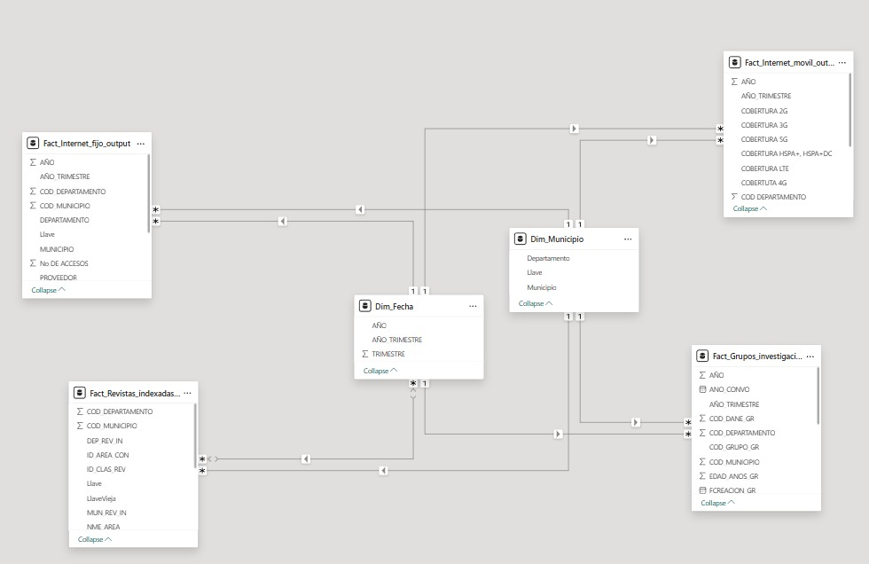
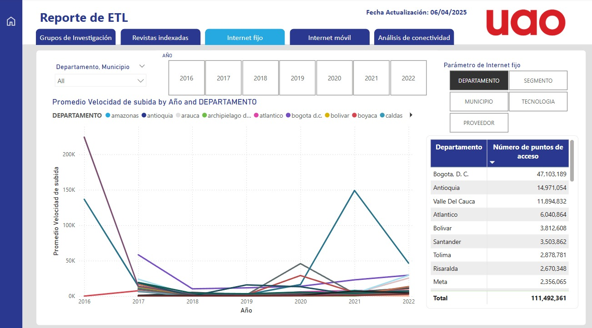
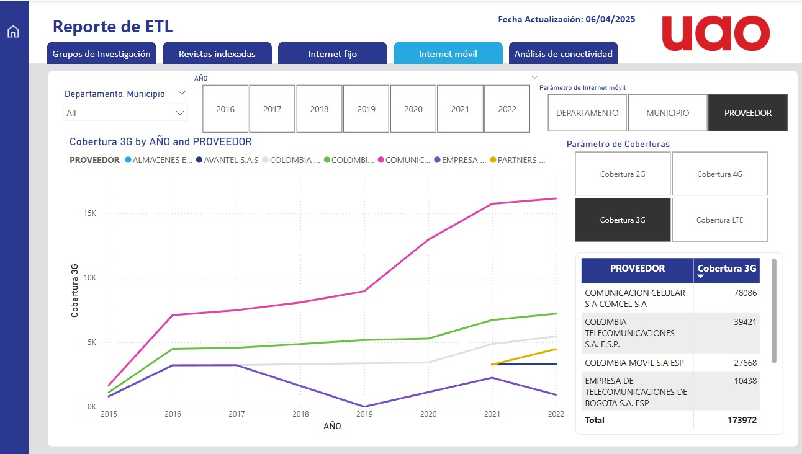
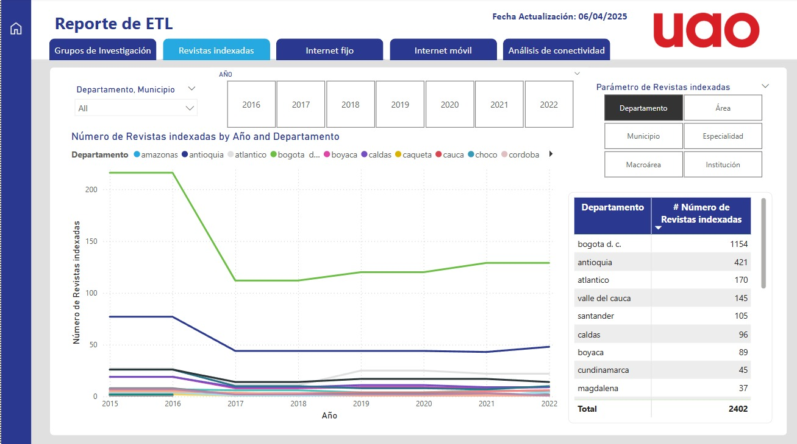
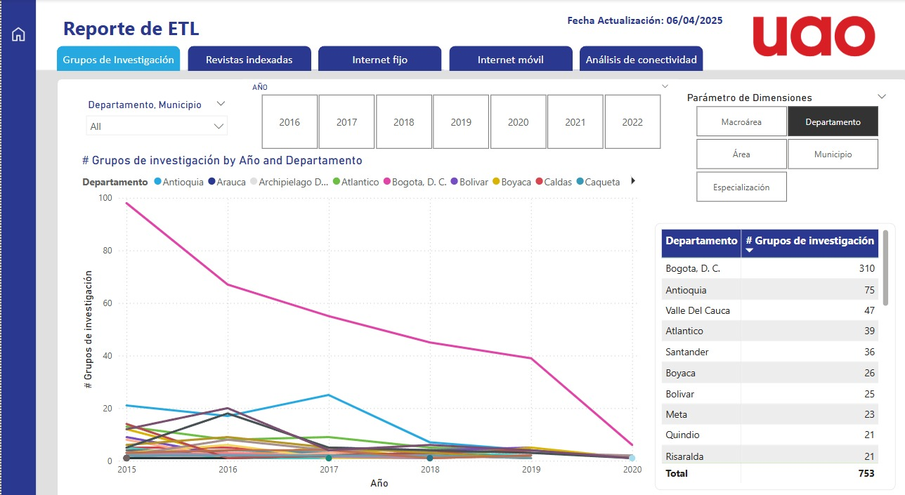
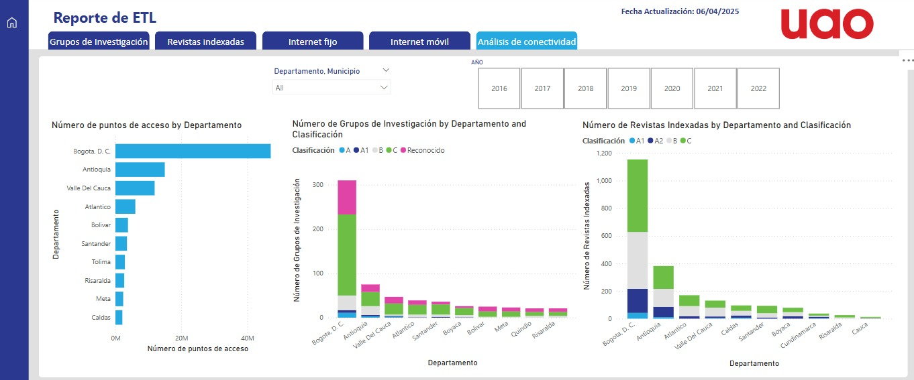

# 📊 Proyecto Final – Curso de ETL y Ciencia de Datos

## 👥 Participantes:
- Juan José Bonilla Pinzón.
- Juan Manuel García Ortiz.
- Ricardo Muñoz Bocanegra.
- Soren Fabricius Acevedo Azuero.

## 🌍 Contexto del Proyecto

### ❓ Descripción del problema:
En la era digital, el acceso a internet es fundamental para el desarrollo y la difusión del conocimiento científico. En Colombia, la cobertura de internet varía significativamente entre los diferentes departamentos, lo que podría afectar la producción científica y el reconocimiento de revistas y grupos de investigación. 

Este proyecto tiene como objetivo analizar la relación entre la cobertura de internet y la producción científica en los departamentos de Colombia, utilizando datos de acceso a internet, revistas indexadas y grupos de investigación.

### 🎯 Justificación del proyecto:
El acceso a internet es una herramienta clave para la comunicación y el intercambio de información científica. Sin embargo, la desigualdad en la cobertura de internet puede limitar las oportunidades de los investigadores en regiones con menor acceso. Analizar esta relación permitirá identificar áreas que podrían beneficiarse de inversiones en infraestructura de internet, promoviendo así un desarrollo científico más equitativo en todo el país.

## 📂 Estructura del Proyecto  

```
uao_etl/
│── 📄 pipeline.py           # Script principal del pipeline ETL
│── 📂 data/                 # Datos del proyecto
│   ├── 📂 raw/              # Datos en bruto sin procesar
│   ├── 📂 processed/        # Datos transformados
│── 📂 extract/              # Módulos de extracción de datosrevistas y grupos
│── 📂 transform/            # Módulos de transformación de datos
│── 📂 load/                 # Módulos de carga de datos
│── 📂 config/               # Configuración
│── 📂 logs/                # Logs del proceso ETL

```


## 📊 Identificación Inicial de Fuentes

| # | 📌 Fuente de Datos | 🌐 Origen | 📄 Tipo | 📦 Volumen |
|---|---------------|--------|------|---------|
| 1 | Cobertura móvil por tecnología, departamento y municipio | Datos Abiertos Colombia | CSV, API | ~41 MB |
| 2 | Internet fijo: Accesos por tecnología y segmento | Datos Abiertos Colombia | CSV, API | ~340 MB |
| 3 | Revistas Indexadas (Índice Nacional Publindex 2017-2020) | Datos Abiertos Colombia | CSV, XML | ~2 MB |
| 4 | Grupos de Investigación Reconocidos | Datos Abiertos Colombia | CSV, API | ~10 MB |

Estos datasets proporcionarán la base necesaria para realizar el análisis exploratorio, la transformación y la modelación de los datos. Al combinar la información sobre la cobertura de internet con los datos de producción científica, esperamos identificar correlaciones y patrones que puedan informar políticas públicas y estrategias de desarrollo.

Este proyecto busca relacionar la cobertura de internet en Colombia (móvil y fija) con la producción científica. Para ello, se realiza un proceso de ETL sobre cuatro datasets:

- **Cobertura de internet fijo**: Contiene información sobre la penetración del servicio de internet fijo en distintos municipios del país.
- **Cobertura de internet móvil**: Presenta datos sobre la disponibilidad de internet móvil en diferentes regiones.
- **Revistas indexadas**: Incluye información sobre publicaciones académicas reconocidas en Colombia.
- **Grupos de investigación en Colombia**: Base de datos con los grupos de investigación registrados en el país.

El propósito del notebook es limpiar, transformar e integrar estos datos para su análisis.

---

## 1. Carga de Datos
Los datos son cargados desde archivos CSV utilizando la biblioteca `pandas`. Esto permite manipular grandes volúmenes de datos de manera eficiente.

```python
import pandas as pd
import numpy as np
from google.colab import files

# Cargamos las librerías necesarias
uploaded = files.upload()
filename = list(uploaded.keys())[0]
df = pd.read_csv(filename)
```

Se realiza una inspección inicial para verificar los tipos de datos, valores faltantes y detectar posibles inconsistencias:

```python
df.dtypes
df.isnull().sum()
df.describe()
```

---

## 2. Transformaciones por Dataset

### a) Cobertura de Internet Fijo

**Objetivo:** Estandarizar la información geográfica y eliminar datos innecesarios.

- Se identificaron valores faltantes en la columna `COD MUNICIPIO`. Para evitar errores en el análisis, estos valores se completaron basándose en registros similares.
- Se eliminaron columnas irrelevantes como `CABECERA MUNICIPAL`, que no aportaban valor analítico.
- Se normalizaron los nombres de municipios y departamentos eliminando tildes y espacios innecesarios para evitar inconsistencias al hacer joins con otros datasets.

```python
df_fijo['MUNICIPIO'] = df_fijo['MUNICIPIO'].str.lower().str.replace(r'\s+', ' ', regex=True)
```

### b) Cobertura de Internet Móvil

**Objetivo:** Limpiar y consolidar la información para reflejar correctamente la cobertura móvil en cada municipio.

- Se eliminaron registros duplicados para evitar redundancias en el análisis.
- En algunos municipios había registros múltiples con diferentes valores de cobertura. Para solucionar esto, se calculó un promedio de la cobertura por municipio y departamento.

```python
df_movil = df_movil.groupby(['COD_DEPARTAMENTO', 'COD MUNICIPIO']).mean().reset_index()
```

### c) Revistas Indexadas

**Objetivo:** Completar información faltante en la ubicación de las revistas indexadas.

- Se detectaron registros donde `DEP_REV_IN` contenía "bogota" pero el código de departamento estaba ausente. Como Bogotá tiene código `11`, se imputó este valor para garantizar una correcta asignación geográfica.
- Se normalizaron nombres de departamentos y ciudades para alinearlos con otros datasets.

```python
df_revistas.loc[df_revistas['DEP_REV_IN'].str.contains('bogota', case=False, na=False), 'COD_DEPARTAMENTO'] = 11
```

### d) Grupos de Investigación

**Objetivo:** Facilitar la integración con otras bases de datos.

- Se estandarizaron los nombres de los departamentos para hacer coincidir esta información con los otros datasets.
- Se eliminaron columnas no relevantes que no contribuían a los análisis posteriores.

---

## 3. Integración de Datos

Se incluyeron dos tablas adicionales al modelo de datos:
- **Dimensión de ubicación**: Especifica los códigos de los municipios, los departamentos a los que pertenecen y el nombre de los municipios.
- **Relación con otras tablas**: En las tablas de salida de los cuatro datasets, la columna `COD_MUNICIPIO` se usará para enlazarlas con la tabla de la dimensión de municipios, lo que facilitará consultas y análisis detallados.
-**Dimensión de tiempo**, en la que se especifica el momento en el que ocurrieron los hechos. Se utilizará una combinación de **año y trimestre** para establecer las relaciones en el modelo de datos.

## 4. Méjoras al código de ETL

### a) Logs

Con el motivo de dejar registros de la ejecución de nuestro podeso de ETL, se agregaron logs. Hicimos uso de la librería logging para crear los registros y os para manejar las rutas en las que se leen y grardan.
El script encargado de darle manejo a los logs se encuentra en  **config/logger.py***. El logger guarda los mensajes en un archivo dentro de la carpeta 'logs' con nombre `etl_<dataset_name>.log`. Si el archivo o la carpeta no existen, se crean automáticamente.

### b) Estructuación del proyecto en sistema de archivos

En aras de modularizar el proyecto, decidimos separar los componentes del ETL en carpetas distintas, teniendo una carpeta para las Fases de extracción, transformación y carga, otra para as configuraciones y las utlilidades generales. A continuacón se presenta el diagrama del sistma de carpetas y archivos del proyecto:

```text
uao_etl/
├── config/
├── data/
│   └── raw/
├── extract/
├── load/
├── notebok/
├── transform/
├── utils/
├── .gitignore
├── LICENSE
├── README.md
├── README_ETL_Windows.md
├── REPORTE_ETL_COMPLETO.pbix
├── pipeline.py
└── requirements.txt
```

Siendo el archivo **pipeline.py** el encargado de la ejecución de nuestro proceso completo de ETL para los datasets de cobertura de internet, revistas indexadas y grupos de investigación en Colombia.

### c) archivos de configuración

Se dispuso un archivo de configuración en **config/datasets_config.py** de las operaciones que se le realizará a cada dataset así como las rutas en las que se encontrarán los datos antes y después de las transformaciones que se le realicen.

Para incluir nuevas fuentes de datos cada dataset debe de tener en su configuración:
- input (str): indicando la ruta donde está ubicado el archivo.
- output (str): indicando el nombre de salida del archivo.
- transformations (Dict[func, args]): listado de transformaciones a aplicar filter_by_year_range.
  
Además, cada transformación debe de tener:
- func (func): función de transformación.
- args (Dict[str, Any]): argumentos de la transformación.

### d) procesamiento en paralelo

Mediante la librería concurrent y el módulo ThreadPoolExecutor de futures, implementamos el procesamiento en paralelo de cada uno de los datasets. Esto con el motivo de mejorar el timepo de ejecución de nuestro proceso de ETL. En nuestro caso se hace uso de cuatro hilos debido a que tenemos este numero de datasets a procesar, a cada uno de ellos se le asigna un hilo diferente. Las operciones sobre cada dataset se hace de forma secuencial debido a que existen operaciones que tienen dependencia de transforaciones anteriores. LA implementación d esta mejora, se encuentra en el archivo **pipeline.py**

## 5. Visualización de los datos

Para visualizar si existe alguna relación entre la cobertura de internet en las diferentes ubicaciones del país y la producción científica, se creó un reporte en Power BI que nos permita ilutrar las tendencias que tenga nuestros datos despues de someterlos al proceso de ETL. Dentro de este reporte se pueden encontrar pestañas que ilustran el comportamiento de la cobertura de internet fijo e internet movil, de la cantidad de grupos de investigación y cantidad de revistas indexadas a través del tiempo, además, podemos encontrar una pestaña adicional en la que se relaciona la cobertura de internet (puntos de acceso a la red) con la cantidad de grupos de investigación y revistas científics indexadas.

Para relacionar nuestras funetes de datos, creamos un modelo semántico en el que se unen nuestros datasets a través de dos tablas de dimensiones, que contienen registros sobre ubicación (departamento y municipio) y se une con nuestros datasets a través de la llave que creamos para este proposito (que se estructura de la forma: código departamento_código municipio) y una tabla de dimensión de tiempo en la que se tienen lso años y los trimestres en lso que ocurrieron los registros de las otras tablas. A continuación se presenta una ilustracion de nuestro modelo semántico:



También presentamos algunas capturas de las pestañas incluidas en nuestro reporte:

- Compoartamiento de la cobertura de internet fijo a través del tiempo:
  


- Compoartamiento de la cobertura de internet movil a través del tiempo:



- Cantidad de revistas indexadas a través del tiempo:



- Cantidad de grupos de investigación científica a través del tiempo:



- Cobertura de internet y su relación con la producción científica:



**Análisis de los resultados**

- Por departamentos la información obtenida de las bases de datos, podemos concluir que los departamentos principales (Bogotá, Antioquia, Valle del Cauca, Atlántico y Santander) son los que cuentan con mayores (Coberturas fijas, Grupos de investigación y Revistas indexadas) esto alineándose bastante con lo esperado dado que son los departamentos más grande de Colombia.

- Las revistas indexadas que durante los últimos años 2015-2022 presentó un mayor número de resultados fue en parte por Ciencias Sociales, seguido de Humanidades, sin embargo se mantiene una brecha corta entre las demás áreas del conocimiento, lo que posibilita a futuro un maor enfoque en estas áreas.

- Por parte de la cobertura Móvil, vemos que Comcel es bastante fuerte en coberturas 2G y LTE sin embargo en 2020 se aprecia una gran caída en este servicio, tendríamos que validar más a fondo qué sucedió durante este año ya que se reportan cifras similares a 2018, indicando un retroceso de 2 años, los demás proveedores mantienen una tendencia similar y con poca brecha.

- Cuando realizamos el análisis cruzado de (departamento, grupos de investigación y revistas) podemos notar que Bogotá lidera con la mayor cantidad de accesos seguido de antioquia y valle del cauca, sin embargo resulta un detalle bastante relevante, que para todos los departamentos se presenta una alta concentración de revistas con calificación “C” lo cual indica una oportunidad de mejora en la calidad de las investigaciones en Colombia, cuando revisamos por grupos de investigación también notamos este mismo comportamiento.

Por lo cual concluimos que a pesar de que se tenga una mayor cobertura de internet fija, tomando los principales departamentos como referentes, no se logra tener una mayor calificación o clasificación de los grupos de investigación y así mismo las revistas indexadas, por lo cual se quedan algunas preguntas abiertas para futuras investigación como ¿Existe la posibilidad de aumentar la cobertura y mejorar la clasificación de las revistas? ¿Los grupos de investigación terminan siendo afectados por otras variables exógenas a las planteadas en este trabajo? ¿La cobertura no es una variable determinante para la clasificación de las revistas? 

---

## 6. Consideraciones Finales

### Desafíos Encontrados
- **Inconsistencia en nombres de municipios y departamentos**: Se resolvió mediante normalización y limpieza de strings.
- **Valores nulos en información geográfica**: Se usaron valores predeterminados y reglas de negocio para completarlos.
- **Registros duplicados en cobertura de internet móvil**: Se consolidaron mediante agregación.

### Futuras Mejoras
- Incorporación de datos de nuevas fuentes sobre producción científica.
- Refinamiento de la integración de datos de cobertura móvil para reflejar tendencias temporales.
- Desarrollo de modelos predictivos basados en estos datos para analizar el impacto de la conectividad en la investigación científica.

---
## Proyecto ETL - Ejecución Local (Windows)

Este proyecto ejecuta un pipeline ETL (Extracción, Transformación, Carga) sobre múltiples datasets, generando logs por cada uno y salidas versionadas.

---

### 🛠️ Requisitos

- Python 3.8 o superior
- Git (opcional, para clonar)
- Terminal (CMD, PowerShell o VSCode)

---

### 🚀 Pasos para ejecutar en local (Windows)

#### 1. Clona o descarga el repositorio
```bash
git clone https://github.com/tu_usuario/tu_repo.git
cd tu_repo
```

#### 2. Crea un entorno virtual
```bash
python -m venv venv
```

#### 3. Activa el entorno virtual
```bash
venv\Scripts\activate
```

#### 4. Instala las dependencias
```bash
pip install -r requirements.txt
```

#### 5. Ejecuta el pipeline ETL
```bash
python pipeline.py
```

---

### 📁 Salidas

- Los archivos transformados se guardan en: `data/processed/`
- Los logs de cada dataset están en: `logs/`

---

### ✅ Ejemplo de salida

```text
Resumen de ejecución ETL:
- internet_fijo: Éxito
- telefonia_movil: Éxito
- revistas_indexadas: Éxito
- grupos_investigacion: Éxito
```

---

### 🧹 Para desactivar el entorno virtual

```bash
deactivate
```

## 📜 Licencia
Este proyecto está licenciado bajo la licencia **Creative Commons** (CC BY 4.0). Puedes compartir y adaptar el contenido, siempre que se otorgue el crédito correspondiente. 

[](https://creativecommons.org/licenses/by/4.0/)
